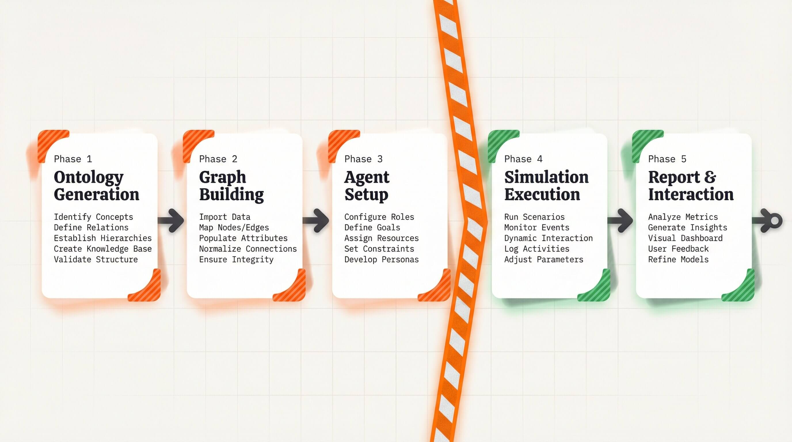
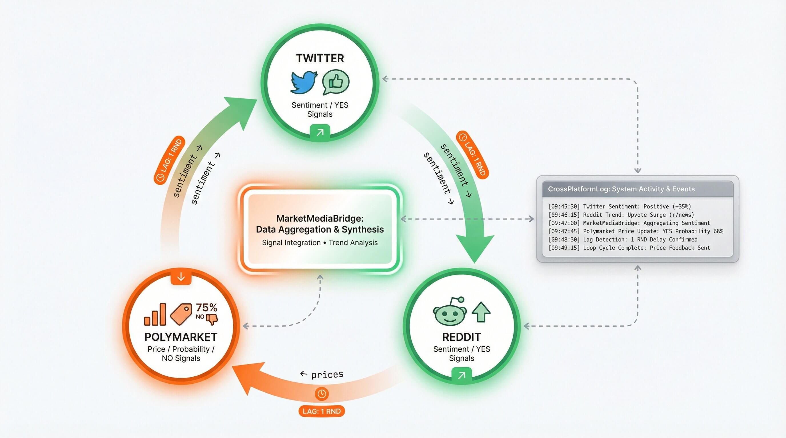

<p align="center">
  
</p>

<h1 align="center">MiroShark</h1>

<p align="center">
  <a href="https://github.com/aaronjmars/MiroShark/stargazers"></a>
  <a href="https://github.com/aaronjmars/MiroShark/network/members"></a>
  <a href="https://x.com/miroshark_"></a>
  <a href="https://bankr.bot/discover/0xd7bc6a05a56655fb2052f742b012d1dfd66e1ba3"></a>
</p>

<p align="center">
  <strong>Universal Swarm Intelligence Engine — Run Locally or with Any Cloud API</strong><br>
  Upload any document (press release, policy draft, financial report) and MiroShark spins up hundreds of AI agents with unique personalities that simulate public reaction across Twitter, Reddit, and a Polymarket-style prediction market — hour by hour.
</p>

<p align="center">
  
</p>

<details>
<summary><strong>Architecture diagrams</strong></summary>

<p align="center"></p>
<p align="center"></p>
<p align="center"></p>

</details>

---

## Quick Start — OpenRouter + `./miroshark`

The recommended path: **one OpenRouter key + the launcher script.** No GPU, no Ollama, no model management. First simulation takes ~15–25 min and costs ~$1.20 (Cheap preset) to ~$3.50 (Best preset).

**Prereqs** — Python 3.11+, Node 18+, Docker (for Neo4j), and a free [OpenRouter key](https://openrouter.ai/).

```bash
git clone https://github.com/aaronjmars/MiroShark.git && cd MiroShark
cp .env.example .env
```

Edit `.env` and paste your OpenRouter key into all five slots (the Best preset — swap `LLM_MODEL_NAME` to `google/gemini-2.0-flash-001` if you want Cheap):

```bash
LLM_API_KEY=sk-or-v1-YOUR_KEY
LLM_BASE_URL=https://openrouter.ai/api/v1
LLM_MODEL_NAME=anthropic/claude-haiku-4.5

SMART_PROVIDER=openai
SMART_API_KEY=sk-or-v1-YOUR_KEY
SMART_BASE_URL=https://openrouter.ai/api/v1
SMART_MODEL_NAME=anthropic/claude-sonnet-4.6

NER_MODEL_NAME=google/gemini-2.0-flash-001
NER_BASE_URL=https://openrouter.ai/api/v1
NER_API_KEY=sk-or-v1-YOUR_KEY

WONDERWALL_MODEL_NAME=google/gemini-2.0-flash-lite-001

OPENAI_API_KEY=sk-or-v1-YOUR_KEY
OPENAI_API_BASE_URL=https://openrouter.ai/api/v1

EMBEDDING_PROVIDER=openai
EMBEDDING_MODEL=openai/text-embedding-3-small
EMBEDDING_BASE_URL=https://openrouter.ai/api
EMBEDDING_API_KEY=sk-or-v1-YOUR_KEY
EMBEDDING_DIMENSIONS=768
```

Then launch everything:

```bash
./miroshark
```

The launcher checks deps, starts Neo4j (Docker or native), installs the frontend + backend, kills anything stale on :3000/:5001, and brings up Vite (`:3000`) + Flask (`:5001`). Ctrl+C stops the lot.

Open `http://localhost:3000` and drop in a document.

<details>
<summary><strong>One-click cloud deploy — Railway or Render</strong></summary>

Create a free [Neo4j Aura](https://neo4j.com/cloud/aura-free/) instance and an OpenRouter key, then:

[](https://railway.app/new/template?template=https://github.com/aaronjmars/MiroShark) &nbsp; [](https://render.com/deploy?repo=https://github.com/aaronjmars/MiroShark)

Set `LLM_API_KEY`, `NEO4J_URI`, `NEO4J_PASSWORD`, `EMBEDDING_API_KEY`, `OPENAI_API_KEY` (all the same OpenRouter key is fine). Cloud deploys don't support Ollama.

</details>

<details>
<summary><strong>Alternative — Docker + local Ollama</strong></summary>

```bash
git clone https://github.com/aaronjmars/MiroShark.git && cd MiroShark
docker compose up -d
docker exec miroshark-ollama ollama pull qwen2.5:32b
docker exec miroshark-ollama ollama pull nomic-embed-text
```

</details>

<details>
<summary><strong>Alternative — Manual + local Ollama</strong></summary>

```bash
docker run -d --name neo4j -p 7474:7474 -p 7687:7687 \
  -e NEO4J_AUTH=neo4j/miroshark neo4j:5.15-community

ollama serve &
ollama pull qwen2.5:32b
ollama pull nomic-embed-text

cp .env.example .env
npm run setup:all && npm run dev
```

</details>

<details>
<summary><strong>Alternative — Claude Code (no API key)</strong></summary>

Use your Claude Pro/Max subscription via the local `claude` CLI.

```bash
npm install -g @anthropic-ai/claude-code
claude   # log in

docker run -d --name neo4j -p 7474:7474 -p 7687:7687 \
  -e NEO4J_AUTH=neo4j/miroshark neo4j:5.15-community

cp .env.example .env
# set: LLM_PROVIDER=claude-code
npm run setup:all && npm run dev
```

Covered by Claude Code: graph building, agent profiles, sim config, reports, persona chat. **Not covered** (needs Ollama or cloud): CAMEL-AI simulation rounds and embeddings. Each LLM call spawns a `claude -p` subprocess (~2–5s overhead) — best for small sims or hybrid mode.

</details>

## Pipeline

1. **Graph build** — NER + ontology extract entities and relationships into a Neo4j knowledge graph (parallelized chunking, batched `UNWIND` writes).
2. **Agent setup** — Personas grounded in the graph. Five context layers per entity: graph attributes, relationships, semantic search, related nodes, and LLM web research (auto-triggers for public figures or thin graph context).
3. **Simulation** — Twitter, Reddit, and Polymarket run in parallel via `asyncio.gather`. Cross-platform context: traders read social posts, social agents see market prices. Sliding-window memory compacts old rounds in a background thread. Per-agent belief state (stance, confidence, trust) updates each round.
4. **Report** — A ReACT agent writes analytical reports using real post/trade history, belief trajectories, graph search, and Nash equilibrium tools.
5. **Interact** — Chat with any agent, send questions to groups, or **branch** the run with a counterfactual ("what if the CEO resigns at round 24?").

## Features

| | |
|---|---|
| **Smart Setup** | Drop a file or URL → 3 scenario cards (Bull/Bear/Neutral) in ~2s with probability bands. Cached per-document SHA. `POST /api/simulation/suggest-scenarios` |
| **What's Trending** | RSS/Atom panel (Reuters, Verge, HN, CoinDesk by default; override with `TRENDING_FEEDS`). One click → article fetch → scenarios. `GET /api/simulation/trending` |
| **Just Ask** | Type a question, get a 1500–3000 char neutral briefing used as seed doc. Cached per question. `POST /api/simulation/ask` |
| **Counterfactual Branching** | Fork at any round with a breaking-news injection. Templates can ship `counterfactual_branches` (e.g. `ceo_resigns`, `rug_pull`, `sec_notice`). `POST /api/simulation/branch-counterfactual` |
| **Director Mode** | Inject live events into a running simulation without forking — up to 10 events × 500 chars. `POST /api/simulation/<id>/director/inject` |
| **Preset Templates** | Six benchmarked scenarios: `crypto_launch`, `corporate_crisis`, `political_debate`, `product_announcement`, `campus_controversy`, `historical_whatif`. `GET /api/templates/list` |
| **FeedOracle MCP** | Opt-in grounded seed data (484 tools: MiCA, DORA, FRED, DEX liquidity, sanctions, carbon markets). Flip `ORACLE_SEED_ENABLED=true`. |
| **Per-Agent MCP Tools** | Personas with `tools_enabled: true` invoke MCP servers mid-simulation via `<mcp_call …/>` tags. Pooled stdio subprocesses, 30s timeout. Configure in `config/mcp_servers.yaml`. |
| **Article Generation** | 400–600 word Substack-style write-up grounded in actual agent behavior. Cached as `generated_article.json`. `POST /api/simulation/<id>/article` |
| **Interaction Network** | Agent-to-agent graph from likes/reposts/replies with centrality, bridge scores, echo-chamber metrics. `GET /api/simulation/<id>/interaction-network` |
| **Demographics** | Archetype clustering (analyst, influencer, retail, observer…) with per-bucket engagement. `GET /api/simulation/<id>/demographics` |
| **Quality Score** | Engagement density, belief coherence, agent diversity, action variance. `GET /api/simulation/<id>/quality` |
| **History DB** | Search/filter/clone/export/delete every sim on disk. `GET /api/simulation/list`, `/history`, `/<id>/export`, `POST /fork` |
| **Trace Interview** | Full reasoning chain (observation → thoughts → action → tool calls) for any agent. `POST /api/simulation/<id>/agents/<name>/trace-interview` |
| **PWA Push** | Service Worker + VAPID web-push alerts for long-running work. Silent no-op without opt-in. |
| **Embed / Publish** | `is_public` toggle. Embed URLs 403 until published. `POST /api/simulation/<id>/publish` |

All features are on by default; each can be toggled via `.env`. See [Configuration](#configuration).

<details>
<summary><strong>Screenshots</strong></summary>

<table>
<tr><td></td><td></td></tr>
<tr><td></td><td></td></tr>
<tr><td></td><td></td></tr>
</table>

</details>

## Architecture

Every round runs all three platforms in parallel. Data flows between them through a shared memory + belief layer:

```
    ┌──────────── Round Memory (sliding window, LLM-compacted) ────────────┐
    │                                                                       │
    ▼                                ▼                                ▼
  Twitter                         Reddit                         Polymarket
  posts/likes/reposts             comments/upvotes/threads       AMM buy/sell/wait
    │                                │                                │
    └────── Market-Media Bridge (social ↔ price cross-prompts) ───────┘
                                     │
                       Per-Agent Belief State
                  (stance -1..+1, confidence 0..1, trust 0..1)
```

**Polymarket** — Single LLM-generated market with non-50/50 starting price. Constant-product AMM. Traders see actual Twitter/Reddit posts alongside portfolio data. Market questions are generated through the Smart slot so framing is sharp and time-bound.

**Performance** — Batched Neo4j `UNWIND` writes (10×), parallel chunking (3×), parallel config batches (3×), all-platform parallel rounds, background memory compaction.

**Per-Round Frame API** — `GET /api/simulation/<id>/frame/<round>` returns a compact snapshot (actions, active agents, prices, belief). Used by ReplayView scrubbing and `miroshark-cli frame`.

<details>
<summary><strong>Graph memory & retrieval stack</strong> (Hindsight / Graphiti / Letta / HippoRAG-inspired)</summary>

**Ingestion**
```
text → NER → batch embed → entity resolution (fuzzy + vector + LLM reflection)
     → MERGE canonical UUIDs → contradiction detection (invalidate old edges)
     → CREATE RELATION {valid_at, invalid_at, kind, source_type, source_id}
```

**Retrieval** (`storage.search(...)`)
```
query → [vector HNSW] + [BM25 fulltext] + [BFS from seeds]
      → temporal + kind filters → top-30 candidates
      → BGE-reranker-v2-m3 cross-encoder (MPS / CUDA / CPU)
      → top-limit with source tags (v / k / g)
```

**Zoom-out** — Leiden community detection + LLM titles/summaries, persisted as `:Community` nodes. Browse via `browse_clusters`.

**Reasoning memory** — Every report persists a full ReACT trace as `(:Report)-[:HAS_SECTION]->(:ReportSection)-[:HAS_STEP]->(:ReasoningStep)`, queryable via `storage.get_reasoning_trace(section_uuid)`.

**What it buys:** multi-hop queries, temporal (`as_of="…"`), epistemic filtering (`kinds=["belief"]`), re-queryable reports, tight first-call recall.

</details>

## Configuration

MiroShark routes different workflows to different models. Four independent slots fall back to **Default** when unset.

| Slot | Env var | Purpose | Call volume |
|---|---|---|---|
| **Default** | `LLM_MODEL_NAME` | Profiles, sim config, memory compaction | ~75–126 |
| **Smart** | `SMART_MODEL_NAME` | Reports, ontology, graph reasoning, prediction-market titles (#1 quality lever) | ~19 |
| **NER** | `NER_MODEL_NAME` | Entity extraction (structured JSON) | ~85–250 |
| **Wonderwall** | `WONDERWALL_MODEL_NAME` | Agent decisions in sim loop (#1 cost driver) | ~850–1650 |

### Cloud presets

| Preset | ~Cost | ~Time | Mix |
|---|---|---|---|
| **Cheap** | $1.20 / run | 13 min | All Gemini Flash — fast, generic personas, thin reports |
| **Best** | $3.50 / run | 25 min | Claude Sonnet for Smart, Haiku for Default, Gemini Flash-Lite for Wonderwall |

Both use `openai/text-embedding-3-small` + `google/gemini-2.0-flash-001:online` for web research. See `models.md` for the full 10-model benchmark.

### Local (Ollama)

> Ollama defaults to 4096-token context — MiroShark needs 10–30k. Create a Modelfile:
> ```bash
> printf 'FROM qwen3:14b\nPARAMETER num_ctx 32768' > Modelfile
> ollama create mirosharkai -f Modelfile
> ```

| Model | VRAM | Speed | Good for |
|---|---|---|---|
| `qwen2.5:32b` | 20GB+ | ~40 t/s | RTX 3090/4090, M2 Pro 32GB+ |
| `qwen3:30b-a3b` MoE | 18GB | ~110 t/s | Fastest — M2 Pro 16GB, RTX 4080 |
| `qwen3:14b` | 12GB | ~60 t/s | RTX 4070, M1 Pro |
| `qwen3:8b` | 8GB | ~42 t/s | Laptops — drop Wonderwall rounds |

Embeddings: `ollama pull nomic-embed-text` (768d).

**Hybrid tip** — local for high-volume sim rounds, Claude for reports:
```bash
LLM_MODEL_NAME=qwen2.5:32b
SMART_PROVIDER=claude-code
SMART_MODEL_NAME=claude-sonnet-4-20250514
```

<details>
<summary><strong>Full environment variables</strong></summary>

```bash
# LLM default
LLM_PROVIDER=openai                # "openai" or "claude-code"
LLM_API_KEY=ollama
LLM_BASE_URL=http://localhost:11434/v1
LLM_MODEL_NAME=qwen2.5:32b

# Smart / Wonderwall / NER overrides (inherit default if unset)
# SMART_PROVIDER=claude-code
# SMART_MODEL_NAME=claude-sonnet-4-20250514
# WONDERWALL_MODEL_NAME=google/gemini-2.0-flash-lite-001
# NER_MODEL_NAME=google/gemini-2.0-flash-001
# CLAUDE_CODE_MODEL=claude-sonnet-4-20250514

# Neo4j
NEO4J_URI=bolt://localhost:7687
NEO4J_USER=neo4j
NEO4J_PASSWORD=miroshark

# Embeddings
EMBEDDING_PROVIDER=ollama
EMBEDDING_MODEL=nomic-embed-text
EMBEDDING_BASE_URL=http://localhost:11434
EMBEDDING_DIMENSIONS=768
EMBEDDING_BATCH_SIZE=128           # drop to 32 if provider 413s

# Retrieval stack
RERANKER_ENABLED=true              # BGE cross-encoder (~1GB one-time)
RERANKER_MODEL=BAAI/bge-reranker-v2-m3
RERANKER_CANDIDATES=30
GRAPH_SEARCH_ENABLED=true
GRAPH_SEARCH_HOPS=1                # 1 or 2
GRAPH_SEARCH_SEEDS=5
ENTITY_RESOLUTION_ENABLED=true
ENTITY_RESOLUTION_USE_LLM=true
CONTRADICTION_DETECTION_ENABLED=true
COMMUNITY_MIN_SIZE=3
COMMUNITY_MAX_COUNT=30
REASONING_TRACE_ENABLED=true

# Web enrichment
WEB_ENRICHMENT_ENABLED=true
# WEB_SEARCH_MODEL=google/gemini-2.0-flash-001:online

# Anthropic prompt caching (silent no-op on non-Claude models)
LLM_PROMPT_CACHING_ENABLED=true

# Live oracle seeds
ORACLE_SEED_ENABLED=false
# FEEDORACLE_MCP_URL=https://mcp.feedoracle.io/mcp
# FEEDORACLE_API_KEY=

# Per-agent MCP
MCP_AGENT_TOOLS_ENABLED=false
# MCP_SERVERS_CONFIG=./config/mcp_servers.yaml
# MCP_MAX_CALLS_PER_TURN=2
# MCP_CALL_TIMEOUT_SEC=30

# Trending
# TRENDING_FEEDS=https://…,https://…

# CAMEL-AI simulation engine (usually matches LLM_* for OpenRouter)
OPENAI_API_KEY=ollama
OPENAI_API_BASE_URL=http://localhost:11434/v1

# Observability (large JSONL — debug only)
# MIROSHARK_LOG_PROMPTS=true
# MIROSHARK_LOG_LEVEL=info          # debug|info|warn
```

</details>

## Claude Desktop (MCP)

Standalone MCP server at `backend/mcp_server.py` — query your graphs from Claude Desktop without opening the web UI.

```json
{
  "mcpServers": {
    "miroshark": {
      "command": "/absolute/path/to/MiroShark/backend/.venv/bin/python",
      "args": ["/absolute/path/to/MiroShark/backend/mcp_server.py"]
    }
  }
}
```

Tools: `list_graphs`, `search_graph`, `browse_clusters`, `search_communities`, `get_community`, `list_reports`, `list_report_sections`, `get_reasoning_trace`.

## CLI

```bash
pip install -e backend/
miroshark-cli ask "Will the EU AI Act survive trilogue?"
# or: python backend/cli.py --help  (no deps)
```

Commands: `ask`, `list`, `status`, `frame`, `publish`, `report`, `trending`, `health`. All accept `--json`. Point at a remote with `MIROSHARK_API_URL`.

## Report Agent Tools

The ReACT report agent (budget via `REPORT_AGENT_MAX_TOOL_CALLS`) exposes:

`insight_forge` (deep-dive), `panorama_search` (vector+BM25+graph), `quick_search`, `interview_agents`, `analyze_trajectory` (belief drift, polarization), `analyze_equilibrium` (Nash on fitted stance game — needs `nashpy`), `analyze_graph_structure`, `find_causal_path`, `detect_contradictions`, `simulation_feed`, `market_state`, `browse_clusters`.

## HTTP API

Base URL `http://localhost:5001` in dev. All JSON unless noted.

<details>
<summary><strong>Setup & Discovery</strong></summary>

| Method | Path | Purpose |
|---|---|---|
| `POST` | `/api/simulation/suggest-scenarios` | Bull/Bear/Neutral cards from a document preview |
| `GET` | `/api/simulation/trending` | RSS/Atom items |
| `POST` | `/api/simulation/ask` | Synthesize seed briefing from a question |
| `POST` | `/api/graph/fetch-url` | Fetch + extract text from a URL |
| `GET` | `/api/templates/list` | Preset templates |
| `GET` | `/api/templates/<id>?enrich=true` | Template + live FeedOracle enrichment |

</details>

<details>
<summary><strong>Graph build</strong></summary>

| Method | Path | Purpose |
|---|---|---|
| `POST` | `/api/graph/ontology/generate` | NER + ontology extraction |
| `POST` | `/api/graph/build` | Build Neo4j graph |
| `GET` | `/api/graph/task/<task_id>` | Poll async task |
| `GET` | `/api/graph/data/<graph_id>` | Paginated nodes + edges |
| `GET` | `/api/simulation/entities/<graph_id>` | Browse entities |
| `GET` | `/api/simulation/entities/<graph_id>/<uuid>` | Entity + neighborhood |

</details>

<details>
<summary><strong>Simulation lifecycle</strong></summary>

| Method | Path | Purpose |
|---|---|---|
| `POST` | `/api/simulation/create` | Create from seed + prompt |
| `POST` | `/api/simulation/prepare` | Profile generation |
| `POST` | `/api/simulation/prepare/status` | Poll preparation |
| `POST` | `/api/simulation/start` | Launch Wonderwall |
| `POST` | `/api/simulation/stop` | Terminate |
| `POST` | `/api/simulation/branch-counterfactual` | Fork with injection |
| `POST` | `/api/simulation/fork` | Duplicate config |
| `POST` | `/api/simulation/<id>/director/inject` | Live event injection |
| `GET` | `/api/simulation/<id>/director/events` | List director events |

</details>

<details>
<summary><strong>Live state, analytics, interaction</strong></summary>

**State** — `/run-status`, `/run-status/detail`, `/frame/<round>`, `/timeline`, `/actions`, `/posts`, `/profiles`, `/profiles/realtime`, `/polymarket/markets`, `/polymarket/market/<mid>/prices`

**Analytics** — `/belief-drift`, `/counterfactual`, `/agent-stats`, `/influence`, `/interaction-network`, `/demographics`, `/quality`, `POST /compare`

**Interaction** — `POST /interview`, `POST /interview/batch`, `POST /<id>/agents/<name>/trace-interview`, `GET /<id>/interviews/<name>`

</details>

<details>
<summary><strong>Publish, report, observability</strong></summary>

**Publish/export** — `POST /<id>/publish`, `GET /<id>/embed-summary`, `POST /<id>/article`, `GET /<id>/export`, `GET /list`, `GET /history`

**Report** — `POST /api/report/generate`, `/generate/status`, `GET /<id>`, `/by-simulation/<sim_id>`, `/<id>/download`, `POST /chat`, `GET /<id>/agent-log`, `/agent-log/stream` (SSE), `/console-log`

**Observability** — `GET /api/observability/events/stream` (SSE), `/events`, `/stats`, `/llm-calls`

**Settings/push** — `GET|POST /api/settings`, `POST /test-llm`, `GET /push/vapid-public-key`, `POST /push/subscribe`, `POST /push/test`

</details>

## Observability

Press **Ctrl+Shift+D** in the UI for the debug panel: Live Feed (SSE), LLM Calls (prompts/responses when `MIROSHARK_LOG_PROMPTS=true`), Agent Trace, Errors.

Events write to `backend/logs/events.jsonl` (global) and `uploads/simulations/<id>/events.jsonl` (per-sim).

Event types: `llm_call`, `agent_decision`, `round_boundary`, `graph_build`, `error`.

## Testing

```bash
cd backend
pytest -m "not integration"              # fast unit suite
pytest -m integration                    # endpoint contracts (needs live backend)
pytest -m "integration and slow"         # full pipeline smoke (minutes)
```

Some integration tests need `MIROSHARK_TEST_SIM_ID=sim_xxx`. CI runs the unit suite on every push.

## Hardware

**Local (Ollama)** — 16/32 GB RAM, 10/24 GB VRAM, 20/50 GB disk (min/recommended).
**Cloud** — any 4 GB machine; just Neo4j and an API key.

## Use Cases

- **PR crisis testing** — simulate public reaction to a press release before publishing
- **Trading signals** — feed financial news, watch simulated market sentiment
- **Policy analysis** — test draft regulations against a simulated public
- **Creative experiments** — feed a novel with a lost ending; agents write a consistent conclusion

---

Support: `0xd7bc6a05a56655fb2052f742b012d1dfd66e1ba3` · AGPL-3.0, see [LICENSE](./LICENSE).

[](https://www.star-history.com/#aaronjmars/miroshark&Date)

## Credits

Built on [MiroFish](https://github.com/666ghj/MiroFish) by [666ghj](https://github.com/666ghj) (Shanda Group). Neo4j + Ollama storage layer adapted from [MiroFish-Offline](https://github.com/nikmcfly/MiroFish-Offline) by [nikmcfly](https://github.com/nikmcfly). Simulation engine powered by [OASIS](https://github.com/camel-ai/oasis) (CAMEL-AI).
